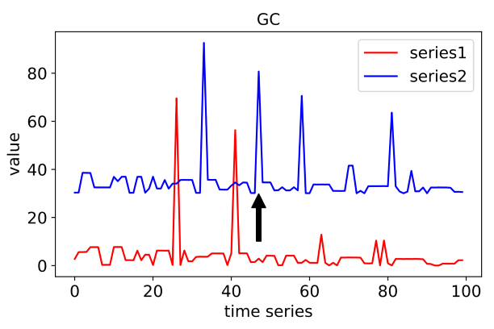
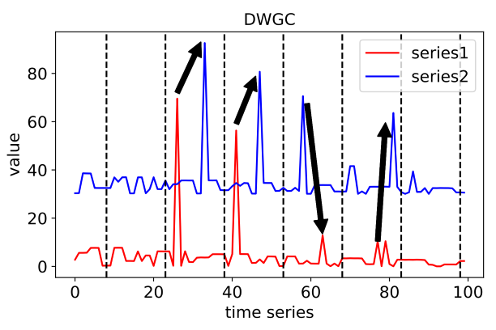

Granger causality
=================

Problem Description of Granger causality
----------------------------------------
Granger causality Detection's task is to find out the Granger causality lies
in multi-channel time series on window level or channel level, like this:

To formalize, give a time series with multi channels:

We aim to find the Granger causality lies in channel level:

We also try to pinpoint causality from the channel level to the point-to-point level:

    
where 2 time points are in the same window index.

Models of Granger causality
---------------------------

+---------------+-------------------------------------------+--------------+--------------+----------------+-----------------------------------------+--------------+
| Abbr          | Algorithm                                 |level         | supervise    | Year           | Class                                   | Ref          |   
+---------------+-------------------------------------------+--------------+--------------+----------------+-----------------------------------------+--------------+
| GC            | Granger causality                         |channel level | unsupervised | 1969           | :class:`realseries.models.GC.GC`        | [GC]_        |
+---------------+-------------------------------------------+--------------+--------------+----------------+-----------------------------------------+--------------+
| DWGC          | Dynamic window-level Granger causality    |window level  | unsupervised | 2020(original) | :class:`realseries.models.DWGC.DWGC`    | [DWGC]_      |
+---------------+-------------------------------------------+--------------+--------------+----------------+-----------------------------------------+--------------+

.. rubric:: References

.. [GC] Clive WJ Granger. Investigating causal relations by econometric models and cross-spectral methods. Econometrica: journal of the Econometric Society, pages 424–438, 1969.
.. [DWGC] Dynamic Window-level Granger Causality of Multi-channel Time Series. Zhiheng Zhang, Wenbo Hu, Tian Tian, Jun Zhu. arXiv:2006.07788. 2020.
