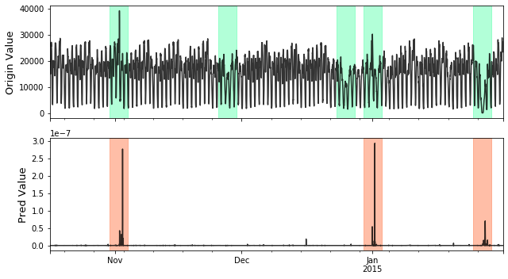
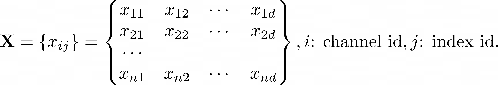
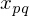

Anomaly Detection
=================

Problem Description
-------------------
Time Series Anomaly Detection's task is to find out the possible anomalies lies
in time series, like this:

To formalize, give a time series with either single channel or multi channels:

We aim to find the possible anomalies lies in X:

Models
------

+---------------+--------------------------------------------------------+---------------------+--------------+------+------------------------------------------------------+-----------------+
| Abbr          | Algorithm                                              | type                | supervise    | Year | Class                                                | Ref             |
+---------------+--------------------------------------------------------+---------------------+--------------+------+------------------------------------------------------+-----------------+
| IForest       | Isolation forest.                                      | outlier ensembles   | unsupervised | 2008 | :class:`realseries.models.iforest.IForest`           | [IForest]_      |
+---------------+--------------------------------------------------------+---------------------+--------------+------+------------------------------------------------------+-----------------+
| LSTM\_dynamic | LSTM based nonparametricanomaly thresholding.          | neural networks     | unsupervised | 2018 | :class:`realseries.models.lstm_dynamic.LSTM_dynamic` | [LSTM_dynamic]_ |
+---------------+--------------------------------------------------------+---------------------+--------------+------+------------------------------------------------------+-----------------+
| Lumino        | A light weight library luminol.                        | distance based      | unsupervised | 2017 | :class:`realseries.models.lumino.Lumino`             | [Lumino]_       |
+---------------+--------------------------------------------------------+---------------------+--------------+------+------------------------------------------------------+-----------------+
| RCForest      | Robust random cut forest.                              | outlier ensembles   | unsupervised | 2016 | :class:`realseries.models.rcforest.RCForest`         | [RCForest]_     |
+---------------+--------------------------------------------------------+---------------------+--------------+------+------------------------------------------------------+-----------------+
| LSTMED        | RNN based time-series prediction.                      | neural networks     | unsupervised | 2016 | :class:`realseries.models.rnn.LSTMED`                | [LSTMED]_       |
+---------------+--------------------------------------------------------+---------------------+--------------+------+------------------------------------------------------+-----------------+
| SR\_CNN       | Spectral Residual and ConvNet based anomaly detection. | neural networks     | supervised   | 2019 | :class:`realseries.models.srcnn.SR_CNN`              | [SR_CNN]_       |
+---------------+--------------------------------------------------------+---------------------+--------------+------+------------------------------------------------------+-----------------+
| STL           | Seasonal and Trend decomposition using Loess.          | weighted regression | unsupervised | 1990 | :class:`realseries.models.stl.STL`                   | [STL]_          |
+---------------+--------------------------------------------------------+---------------------+--------------+------+------------------------------------------------------+-----------------+
| VAE           | Variational Auto-Encoder anomaly detection.            | probabilistic       | unsupervised | 2018 | :class:`realseries.models.vae_ad.VAE_AD`             | [VAE]_          |
+---------------+--------------------------------------------------------+---------------------+--------------+------+------------------------------------------------------+-----------------+

.. rubric:: References

.. [IForest] Liu F T, Ting K M, Zhou Z H. Isolation forest[C]//2008 Eighth IEEE International Conference on Data Mining. IEEE, 2008: 413-422.
.. [LSTM_dynamic] Hundman K, Constantinou V, Laporte C, et al. Detecting spacecraft anomalies using lstms and nonparametric dynamic thresholding[C]//Proceedings of the 24th ACM SIGKDD International Conference on Knowledge Discovery & Data Mining. 2018: 387-395.
.. [Lumino] Luminol. Github, https://github.com/linkedin/luminol
.. [RCForest] S. Guha, N. Mishra, G. Roy, & O. Schrijvers, Robust random cut forest based anomaly detection on streams, in Proceedings of the 33rd International conference on machine learning, New York, NY, 2016 (pp. 2712-2721).
.. [LSTMED] Malhotra P, Ramakrishnan A, Anand G, et al. LSTM-based encoder-decoder for multi-sensor anomaly detection[J]. arXiv preprint arXiv:1607.00148, 2016.
.. [SR_CNN] Ren H, Xu B, Wang Y, et al. Time-Series Anomaly Detection Service at Microsoft[C]//Proceedings of the 25th ACM SIGKDD International Conference on Knowledge Discovery & Data Mining. 2019: 3009-3017.
.. [STL] Cleveland R B. STL: A seasonal-trend decomposition procedure based on loess. 1990[J]. DOI: citeulike-article-id, 1435502.
.. [VAE] Xu H, Chen W, Zhao N, et al. Unsupervised anomaly detection via variational auto-encoder for seasonal kpis in web applications[C]//Proceedings of the 2018 World Wide Web Conference. 2018: 187-196.
.. [Robust] Su Y, Zhao Y, Niu C, et al. Robust Anomaly Detection for Multivariate Time Series through Stochastic Recurrent Neural Network[C]//Proceedings of the 25th ACM SIGKDD International Conference on Knowledge Discovery & Data Mining. 2019: 2828-2837.
.. [NAB] Ahmad S, Lavin A, Purdy S, et al. Unsupervised real-time anomaly detection for streaming data[J]. Neurocomputing, 2017, 262: 134-147.
.. [NAB2] Lavin A, Ahmad S. Evaluating Real-Time Anomaly Detection Algorithms--The Numenta Anomaly Benchmark[C]//2015 IEEE 14th International Conference on Machine Learning and Applications (ICMLA). IEEE, 2015: 38-44.

