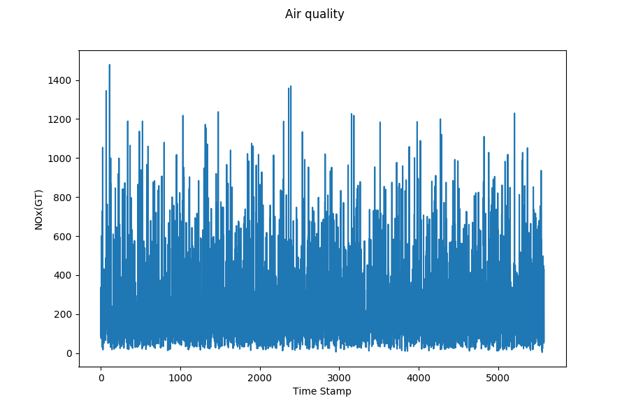
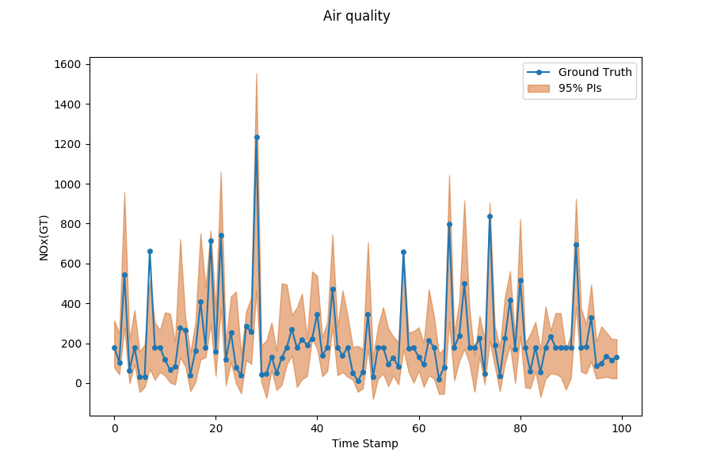

Forecast with Uncertainty
=========================

Problem Description
-------------------

Time Series Forecast's task is to  model multiple regression sub-problems in sequence,  and the tendency along the sliding windows can beused to examine the obtained predictive uncertainty. Forecasting involves taking models fit on historical data and using them to predict future observations.

To formalize, give a time series with either single channel or multi channels:

.. math:: Y=\left\{\boldsymbol{y_{1}}, \boldsymbol{y_{2}}, \ldots, \boldsymbol{y_{T}}\right\} \text { where } \boldsymbol{y_{t}} \in \mathbb{R}^{n}

where :math:`n` is the variable dimension or channels, we aim at predicting a series of future signals in a rolling forecasting fashion. That being said, to predict :math:`y_{T+h}`, where :math:`h` is the desirable horizon ahead of the current time stamp,  we assume :math:`\left\{\boldsymbol{y_{1}}, \boldsymbol{y_{2}}, \ldots, \boldsymbol{y_{T}}\right\}` are available. Likewise, to predict the value of the next time stamp :math:`y_{T+h+1}`, we assume :math:`\left\{\boldsymbol{y_{1}}, \boldsymbol{y_{2}}, \ldots, \boldsymbol{y_{T}}, \boldsymbol{y_{T+1}}\right\}` are available. We hence formulate the input matrix at time stamp :math:`T` as :math:`X_{T}=\left\{\boldsymbol{y}_{1}, \boldsymbol{y}_{2}, \ldots, \boldsymbol{y}_{T}\right\} \in \mathbb{R}^{n \times T}`.

Moreover, we also want to know the uncertainty of predictive distribution, a calibrated forecaster outputs the cumulative distribution function (CDF) :math:`F_i` by the predictive distribution for each input :math:`x_i`. Generally, we use predictive intervals (PIs) to represent the uncertainty. For example, given the probability 95%, the forecaster should output the 95% prediction interval. 

Models
------

+---------------+---------------------------------------------------------------------------------------------+-------------------------------+--------------+------+------------------------------------------------------+-----------------+
| Abbr          | Algorithm                                                                                   | type                          | supervise    | Year | Class                                                | Ref             |
+---------------+---------------------------------------------------------------------------------------------+-------------------------------+--------------+------+------------------------------------------------------+-----------------+
| CRMMD         | Using maximum mean discrepancy (MMD) to perform distribution matching.                      | kernel distance, two-step     | supervised   | 2020 | :class:`realseries.models.crmmd.CRMMD`               | [CRMMD]_        |
+---------------+---------------------------------------------------------------------------------------------+-------------------------------+--------------+------+------------------------------------------------------+-----------------+
| HNN           | Heteroscedastic neural networks output the mean and variance to obtain the uncertainty.     | neural networks               | supervised   | 2017 | :class:`realseries.models.hnn.HNN`                   | [HNN]_          |
+---------------+---------------------------------------------------------------------------------------------+-------------------------------+--------------+------+------------------------------------------------------+-----------------+
| MC-dropout    | Approximate Bayesian inference in deep Gaussian process.                                    | Bayesian approximation        | supervised   | 2016 | :class:`realseries.models.mc_dropout.MC_dropout`     | [MC-dropout]_   |
+---------------+---------------------------------------------------------------------------------------------+-------------------------------+--------------+------+------------------------------------------------------+-----------------+

.. rubric:: References

.. [CRMMD] Peng Cui, Wenbo Hu and Jun Zhu. Calibrated Reliable Regression using Maximum Mean Discrepancy. arXiv: 2006.10255.
.. [HNN] Alex Kendall and Yarin Gal.  What uncertainties do we need in Bayesian deep learning forcomputer vision?Advances in neural information processing systems, pages 5574–5584, 2017.
.. [MC-dropout] Yarin Gal and Zoubin Ghahramani. Dropout as a Bayesian approximation:  Representingmodel uncertainty in deep learning. Ininternational conference on machine learning, pages1050–1059, 2016.

